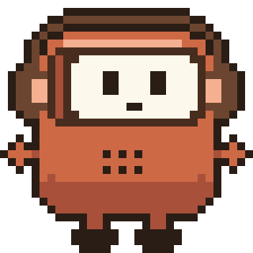

  

<h1 align="center">Mr. Nook</h1>

<em>An audiobook app with a small robot who reads along.</em>

Private testing &middot; 2026

 

## Hello

Mr. Nook is a small robot with headphones and a book for a face. He keeps you company while you listen,
and he doesn't mind if you fall asleep halfway through a chapter.

## Status

In private testing. The source code is not public, and there is nothing to install here yet.
When Mr. Nook is ready for more people, this page will say so.

## Contact

Questions, or interest in testing: through GitHub, [nzrbits](https://github.com/nzrbits).

## Family

Mr. Nook is the sibling of [Melinda](https://github.com/nzrbits/melinda-app), a cozy little helper for your paper mail.

 

  

&copy; 2026 nzrbits. Name, mascot and artwork are not free to reuse.

